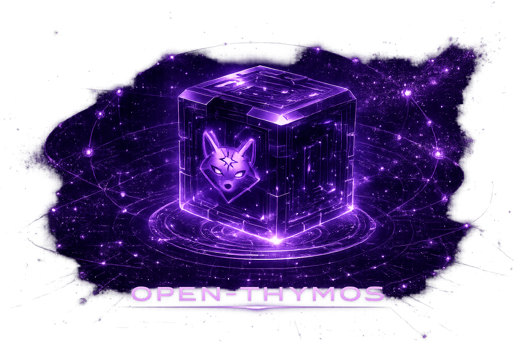

<div align="center">



[](https://github.com/gryszzz/open-thymos/releases/latest) [](https://github.com/gryszzz/open-thymos) [](LICENSE) 

# open-thymos

### Get OpenThymos

<div align="center">
<table>
<tr>
<td width="50%" valign="top" align="center">

#### ◇ Desktop app


Immersive, **local-first** GUI  chat, live runs, the 3D **Mind** reasoning view,
audit + replay. Connect **any model** from the Providers tab  Claude, OpenAI,
Ollama / LM Studio (local), or any OpenAI-compatible adapter. Your keys never
leave your machine; no phone-home.

[](docs/rfcs/desktop-app.md)

Run it now (dev build):<br/>
`cd thymos/clients/desktop && npm install && npm run dev`

<sub>One-click `.dmg` / `.msi` / `.AppImage` ships with the next signed release.</sub>

</td>
<td width="50%" valign="top" align="center">

#### ▣ CLI + runtime


Terminal, scriptable, server. No Rust, no clone, no compile.

[](https://github.com/gryszzz/open-thymos/releases/latest) [](https://github.com/gryszzz/open-thymos/releases/latest) [](https://github.com/gryszzz/open-thymos/releases/latest)

`curl -fsSL https://raw.githubusercontent.com/gryszzz/open-thymos/main/scripts/get.sh | sh`

</td>
</tr>
</table>
</div>


</div>

---

**Cognition proposes. The runtime governs. The ledger records.**


A model cannot call a tool, mutate state, spend budget, delegate authority, or erase history  not by convention, by runtime semantics. Every effect passes through a typed proposal, a signed capability writ, a policy trace, and an append-only execution ledger.

```text
Intent → Proposal → Commit
```

| Stage | Type | Authority |
|-------|------|-----------|
| `Intent` | Emitted by cognition | None — content-addressed, no execution rights |
| `Proposal` | Compiled by the runtime | Bound to a signed `Writ` + policy trace |
| `Commit` | Written to the ledger | The only record that mutates world state |

<p align="center">
  <a href="https://gryszzz.github.io/open-thymos/specification/">Specification</a>
  &nbsp;·&nbsp;
  <a href="docs/architecture.md">Architecture</a>
  &nbsp;·&nbsp;
  <a href="https://gryszzz.github.io/open-thymos/replay/">Replay</a>
  &nbsp;·&nbsp;
  <a href="https://gryszzz.github.io/open-thymos/capability-writs/">Capability Writs</a>
  &nbsp;·&nbsp;
  <a href="docs/rfcs/">RFCs</a>
</p>

---

## What it's for

If "the model just did **what?!**" is an unacceptable failure mode for you, this is the
kernel that makes agent actions **authorized, auditable, and replayable** instead of
trust-the-prompt. Concretely:

- **Agents that touch money, infra, or data.** A model can *propose* anything, but a
  signed capability writ — tool scopes, effect ceiling (read / write / external /
  irreversible), budget, time window — decides what actually runs. Effects are enforced
  *in the compiler*, not by prompt convention.
- **Audit & compliance for AI actions.** Every action is an append-only, hash-chained
  ledger entry recording *what was done, under whose authority, and which policy decision
  permitted it*. `thymos audit <run-id>` renders that whole trail for a human — the
  artifact an auditor actually wants.
- **Post-incident forensics via deterministic replay.** Replay folds committed deltas to
  reconstruct the exact world state, and *rejects* compiler drift, policy drift, and
  unsigned commits. "The agent did something bad on Tuesday" becomes reproducible and
  verifiable, not guesswork.
- **Multi-tenant agent platforms.** Tenant-scoped writs and delegation where a parent
  mints a child writ that is a *strict subset* of its own authority — so agents you host
  for others can't exceed granted authority or cross tenant boundaries.
- **A governance layer under a router.** Routing decides what's *optimal*; THYMOS decides
  what's *allowed* and proves what *happened*. Routing evidence is recorded for audit but
  **never** read for authority (see the [WisePick integration](docs/integrations/wisepick.md)).
- **Human-in-the-loop approval gates.** Irreversible actions can suspend for quorum
  approval instead of executing — "the agent drafts the wire transfer; a human signs off."

**What it is _not_ (yet):** a turnkey product. It's a reference kernel — see
[STATUS.md](STATUS.md) for the honest line between what's enforced-and-tested and what's
still gated (Postgres on the HTTP path, live-model CI proofs run in CI).

## The Threat Model

OpenThymos treats cognition as **untrusted input**. The runtime enforces this structurally:

- Cognition emits intents — it cannot execute
- Authority is carried by signed writs — it cannot be asserted inline
- State is a projection of committed ledger deltas — it cannot be mutated in place
- Every rejection, approval, and delegation is a ledger event — it cannot be erased
- Replay proves the world projection from the commit sequence — it cannot call providers or re-run tools

If a proposal reaches the tool boundary, it was already authorized by a writ, cleared by the compiler, and permitted by the policy engine. The ledger records everything that happened and everything that was refused.

## Execution Model

The compiler is a pure function:

```
(Intent, Writ, World, ToolRegistry, PolicyEngine) → Proposal
```

A proposal is one of three outcomes:

- **Staged** — authority, budget, time window, scope, and policy all passed. Reaches the tool boundary.
- **Suspended** — policy returned `RequireApproval { channel, reason }`. Written to the ledger as `PendingApproval`.
- **Rejected** — writ check, budget, scope, or policy `Deny` failed. Written to the ledger as `Rejection`.

Only a `Staged` proposal executes. Only a `Commit` mutates world state.

## Five Runtime Guarantees

These are invariants, not goals. They are checked structurally by the runtime, recorded in the ledger, and verifiable by replay.

| | Guarantee |
|--|-----------|
| **I** | A valid ledger can be folded into the same world projection under the recorded commit sequence. |
| **II** | Cognition cannot execute tools or mutate state directly. The provider boundary is enforced at the type level. |
| **III** | Only staged proposals may reach the tool boundary. Only commits may mutate projected world state. |
| **IV** | Tool scopes, budgets, time windows, effect ceilings, tenant boundaries, and delegation bounds are checked before execution. |
| **V** | Policy decisions are recorded as proposal traces and cannot be erased by a client surface. |

## Enforcement & Hardening

These make the guarantees above structural rather than aspirational. Each is in
the runtime today and covered by tests:

- **Effect-ceiling enforcement.** The compiler rejects any tool whose declared
  effect class (`Read` / `Write` / `External` / `Irreversible`) exceeds the
  writ's effect ceiling — *before* the tool runs. A read-only writ cannot drive
  an external or irreversible tool even when the tool name is in scope.
- **Auditable commits.** Every commit records the originating `intent_id`, the
  `policy_trace` that authorized it, and a `policy_set_hash` of the active rule
  set — so a permitted action's *why* lives in the ledger, not just its *what*.
- **Signed commits (optional).** A runtime configured with a commit-signing key
  ed25519-signs every commit; replay can require each commit verify against the
  corresponding public key.
- **Secret redaction.** Tool observations pass through a redactor before they
  enter the append-only ledger (and before cognition re-reads them), so
  credentials are not written to permanent storage.
- **Model-spend budgeting.** Cognition token/USD usage is debited against the
  writ budget; a run halts when the model budget is exhausted, not only when
  tool-call budget is.
- **Fork-proof append.** The ledger enforces a unique `(trajectory, seq)`
  invariant inside an immediate transaction, so concurrent writers cannot fork
  a trajectory's chain.
- **Drift detection on replay.** Replay can pin the compiler version, the
  policy-set hash, and commit signatures — flagging compiler, policy, or
  identity drift long after a run.
- **Writ revocation + anti-replay.** A capability can be pulled at runtime (the
  compiler rejects it, with a one-level child cascade); every writ carries a
  nonce so it is individually identifiable.
- **Idempotency.** An `External` / `Irreversible` tool executes at most once per
  content-addressed proposal — retries and re-approvals return the prior commit.
- **Multi-party approval.** A suspended proposal can require M-of-N distinct
  approvers; any explicit denial vetoes. Irreversible, non-compensable tools can
  be gated to *require* approval.
- **Compensation / saga rollback.** Compensable tools are undone newest-first —
  including across delegated child trajectories — and each rollback is itself a
  recorded, replayable commit.
- **External anchoring.** A Merkle root over a trajectory's entries gives
  third-party tamper-evidence on top of the internal hash chain.
- **Pluggable clock.** Time-window checks read an injectable clock (an attested
  source, or a fixed clock in tests), not the bare host wall clock.
- **Declarative policy.** Signed JSON policy bundles loadable at runtime
  (`eq/ne/gt/lt/in/contains` + `all/any/not` over intent / writ / world), in
  addition to in-process Rust policies.
- **Routing evidence (advisor integration).** Optional provider routing metadata
  is recorded immutably in the ledger (excluded from `ProposalId`) and never read
  for authority — plus a safe, pull-based `/routing-outcomes` feedback export
  that leaks no workload content. See [WisePick integration](docs/integrations/wisepick.md).

For the precise, adversarially-written line between *proven*, *gated*, and *not
built*, see **[STATUS.md](STATUS.md)**. Replay verifies and folds the ledger — it
does not (and for an LLM cannot) re-execute cognition or tools.

## Capability Writs

Authority is carried by ed25519-signed capability writs. A writ declares:

- who issued the authority (issuer pubkey)
- which subject may act (subject pubkey)
- which tools are in scope (glob patterns)
- which effects are allowed (effect ceiling)
- how much budget is available (tokens, tool calls, wall clock, USD millicents)
- when the authority is valid (not_before, expires_at)
- whether the subject may subdivide authority (delegation bounds)

Child writs must be strict subsets of parent writs. Cross-tenant delegation is forbidden. Provider identity grants no authority.

## Replay

Replay is a proof procedure over the execution ledger:

```bash
thymos replay run_847 --verify --fold-world --policy-trace
```

The verifier walks every ledger entry, recomputes hashes, checks the parent chain, verifies sequence continuity, re-applies committed deltas in order, and reports the compiler versions seen. It cannot call providers. It cannot execute tools. It cannot mutate state.

```bash
cargo test -p thymos-ledger --features sqlite bench -- --include-ignored --nocapture
```

Phase I baseline (macOS arm64, SQLite in-memory, mock provider, 1 root + 1000 commits):

```text
replay_speed   ~12,400 entries/sec   (hash verify + parent chain + world fold)
ledger_folding ~656,000 commits/sec  (delta application only)
exec_overhead  ~1.35 ms/proposal     (compile + policy + tool execute + ledger append)
```

## Workspace

The runtime is implemented as a Rust workspace under [`thymos/`](thymos):

| Crate | Responsibility |
|-------|----------------|
| `thymos-core` | Intent, Proposal, Commit, Writ, World, structured deltas |
| `thymos-compiler` | Pure proposal compilation — writ check, budget, scope, policy, type |
| `thymos-policy` | Policy evaluation, `PolicyDecision`, `PolicyTrace` |
| `thymos-ledger` | Append-only entries, BLAKE3 hash chain, replay verifier |
| `thymos-runtime` | IPC cycle, approvals, delegation, projection, resume |
| `thymos-cognition` | Provider abstraction — emits intents, no authority |
| `thymos-tools` | Rust tool contracts, JSON manifests, MCP bridges, observed effects |
| `thymos-server` | HTTP runtime server — sessions, approvals, SSE streams |
| `thymos-cli` | Terminal access to the runtime — `thymos replay`, `thymos run` |

## Quick Start

Five steps. The default model is an offline **mock**, so steps 1–2 need no keys.

**1 · Install the `thymos` command**

```bash
cargo install --path thymos/crates/thymos-cli
thymos          # ← the home screen: what it does, every command, example tasks
```

**2 · Start the runtime** (in its own terminal)

```bash
cd thymos
cargo run -p thymos-server      # http://localhost:3001 · mock model by default, no key needed
```

**3 · Connect a real model** *(optional — mock works offline)*

```bash
thymos setup                    # shows every option: API keys + local LLMs
thymos use openai               # or anthropic · groq · ollama · gemini · … then add the key it names
# restart the server so it picks the model up
```

**4 · Give it a task and watch it work**

```bash
thymos run "Map this repo and summarize how the runtime boundary works" --follow --scopes fs_read,grep
```

You'll watch **Intent → Proposal → Commit** stream live, then a summary. `thymos tools`
lists every real-world action the agent can take (shell, http, fs, mcp…).

**5 · See the governance**

```bash
thymos audit  <run-id>          # the full trail: each action, its policy verdict, + replay proof
thymos replay <run-id>          # verify the ledger folds to its world
```

> **In a hurry?** `./scripts/quickstart.sh` runs one governed end-to-end proof with the
> offline mock — no install, no keys. Pass a task + `ANTHROPIC_API_KEY=…` to prove it on a real model.


**Install options (CLI + runtime)** — prebuilt for macOS / Linux / Windows, no toolchain:

```bash
# one line (macOS / Linux) — installs to ~/.local/bin, github-only, no telemetry
curl -fsSL https://raw.githubusercontent.com/gryszzz/open-thymos/main/scripts/get.sh | sh
brew install gryszzz/tap/thymos                                   # Homebrew
docker run --rm -p 3001:3001 ghcr.io/gryszzz/openthymos-runtime:latest   # Docker
```

Or grab a binary directly from the
[latest release](https://github.com/gryszzz/open-thymos/releases/latest), unpack,
and run `thymos-server` then `thymos shell`. The desktop app is a **client** of
this same governed runtime — it can't bypass the `Intent → Proposal → Commit`
boundary. Scope + honest status: [docs/rfcs/desktop-app.md](docs/rfcs/desktop-app.md).

### Run a dev build & track changes

Want the latest unreleased code (e.g. the freshest CLI/UI) instead of a tagged
release? Build from source — every binary reports its exact build:

```bash
git clone https://github.com/gryszzz/open-thymos && cd open-thymos/thymos
cargo run -p thymos-server                       # dev runtime
cargo run -p thymos-cli -- shell                 # dev CLI
cargo install --path crates/thymos-cli           # put the dev `thymos` on PATH

thymos --version                                 # e.g. "thymos 0.5.0 (a1b2c3d)"
git log --oneline -10                            # the changes that build contains
```

`thymos --version` prints `<version> (<git-sha>)`, so you can always tell which
build you're on and map it to a commit. Desktop dev mode:
`cd clients/desktop && npm install && npm run dev` (hot-reloads the UI).

**Nightly builds** (no toolchain): once the Nightly workflow has run, the
[`nightly`](https://github.com/gryszzz/open-thymos/releases/tag/nightly)
prerelease carries fresh binaries rebuilt from `main` each day:

```bash
curl -fsSL https://raw.githubusercontent.com/gryszzz/open-thymos/main/scripts/get.sh | THYMOS_VERSION=nightly sh
```

**Multi-agent delegation** — a parent mints a child writ ⊆ its own authority, the
child runs on its own trajectory, the ledger shows the lineage, replay reconstructs both:

```bash
cargo run --example delegation_lineage -p thymos-runtime   # see docs/demos/delegation-lineage.md
```

**Verify everything** (mock cognition, SQLite, governance enforced): `cd thymos && cargo test --workspace`.
Run it on a real model, a **Postgres** ledger, or production-shaped mode — see
**[Getting Started](docs/getting-started.md)**. Gated proofs (`live_provider`,
`postgres_integration`) run when their secrets are present; see [STATUS.md](STATUS.md).

The Postgres HTTP runtime path is active only when the server is built with
`--features postgres` *and* `THYMOS_POSTGRES_URL` is set; otherwise it falls
back to SQLite. Confirm the live backend in `/health` via `"ledger":"postgres"`.

### Use (almost) any model

Cognition is a swappable proposer — it only emits intents; the runtime governs
every effect no matter the model. Native **Anthropic** and **OpenAI** adapters,
plus one-name presets for every major OpenAI-compatible provider and local
runtime. `thymos providers` lists them all.

```bash
# Hosted: name the provider, set its key, start.
THYMOS_DEFAULT_PROVIDER=groq GROQ_API_KEY=… cargo run -p thymos-server
# Local (no key): just have the runtime running.
THYMOS_DEFAULT_PROVIDER=ollama THYMOS_DEFAULT_MODEL=llama3.2 cargo run -p thymos-server
# Per run — a preset, or any OpenAI-compatible URL directly:
thymos run "…" --provider openrouter --model openai/gpt-4o-mini
thymos run "…" --provider openai --base-url https://your-host/v1 --model your-model
```

Presets: `openai` · `groq` · `openrouter` · `together` · `deepseek` · `mistral` ·
`xai` · `fireworks` · `nvidia` · `cerebras` · `gemini` · `perplexity` ·
`huggingface` · `ollama` · `lmstudio` · `vllm` · `llamacpp` · `localai`. Keys are
read **server-side** — only a provider *name* crosses the wire, never a key.

## Repository

| Path | Purpose |
|------|---------|
| [`thymos/`](thymos) | Rust workspace — runtime, compiler, ledger, policy, tools, server, CLI |
| [`docs/`](docs) | Specification, architecture, replay, capability writs, invariants |
| [`docs/rfcs/`](docs/rfcs) | Accepted RFCs for protocol-level changes |
| [`docs/benchmarks.md`](docs/benchmarks.md) | Benchmark matrix, reporting format, Phase I baseline |
| [`GOVERNANCE.md`](GOVERNANCE.md) | Project authority and decision process |
| [`RFC_TEMPLATE.md`](RFC_TEMPLATE.md) | Protocol change template |

## Design Philosophy

OpenThymos is not a model wrapper. It is an execution substrate with durable runtime semantics.

The existing agent ecosystem collapses cognition and execution into one loop  a model chooses a tool, calls it, reads the result, and continues. That design is easy to demo and hard to govern. Tool calls happen before authority is modeled. Policy is applied as application code. State is reconstructed from logs after the fact, if at all.

OpenThymos separates intent from authority, authority from compilation, and compilation from execution. None of these boundaries are optional.

The goal is not to maximize surface area. The goal is to define small, durable runtime semantics for governed cognition  semantics that remain legible decades from now.


