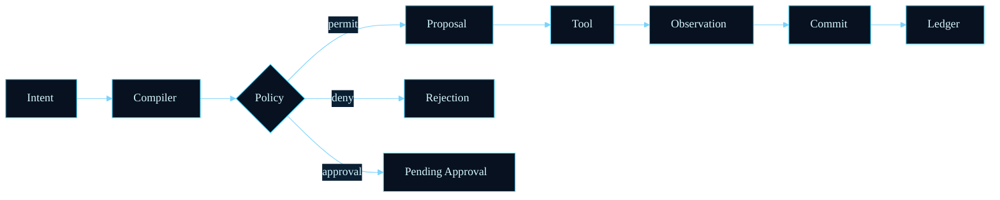
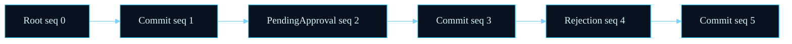
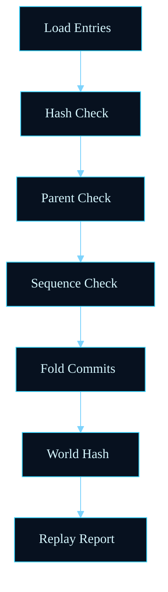
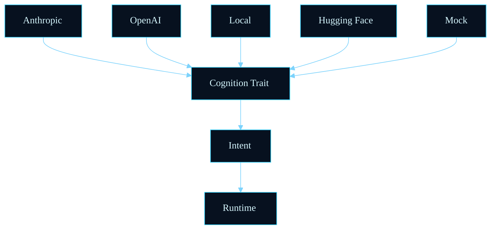
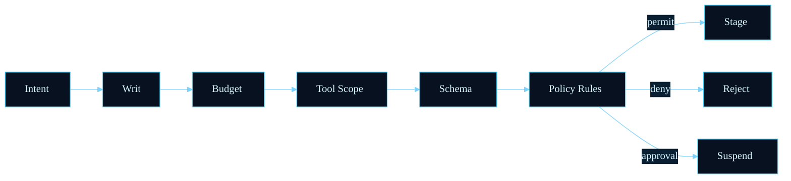
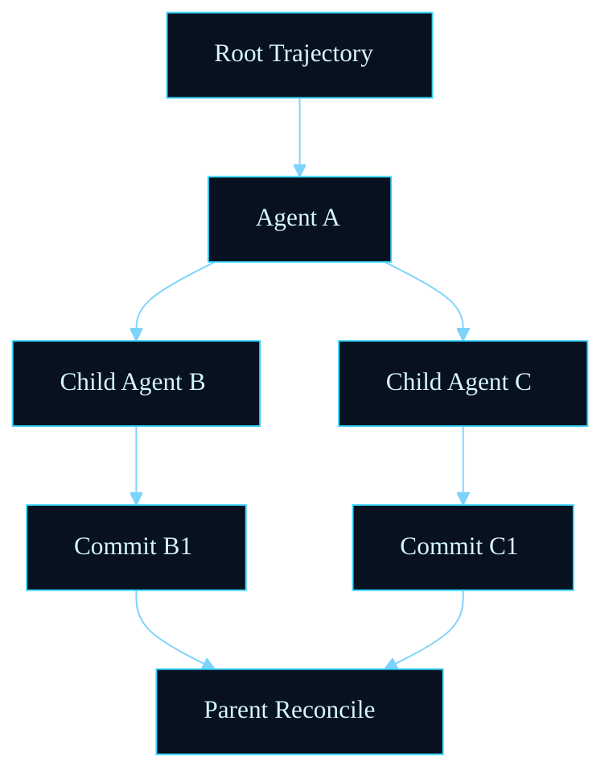
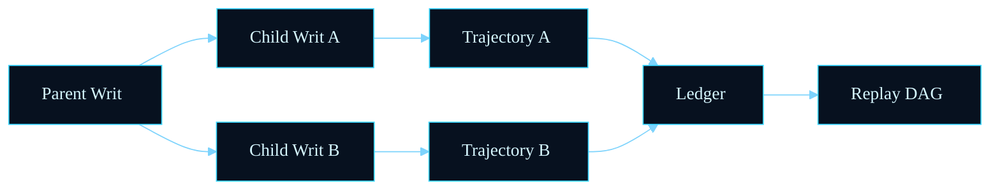
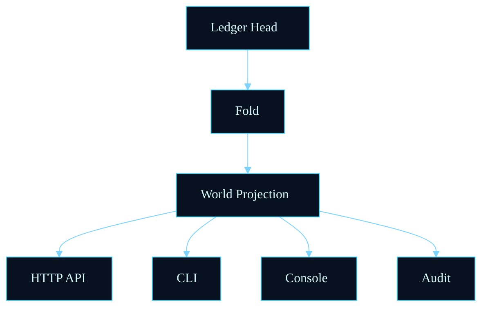

# Diagrams

The diagrams below use Mermaid with a dark blueprint theme. They are intended
as protocol diagrams, not product illustrations.

## Intent To Proposal To Commit

## Execution Ledger

## Runtime Folding

## Replay Engine

## Provider Abstraction

## Policy Validation Flow

## Capability Writ Lifecycle

## Agent Execution DAG

## Multi-Agent Coordination

## Runtime State Projection

